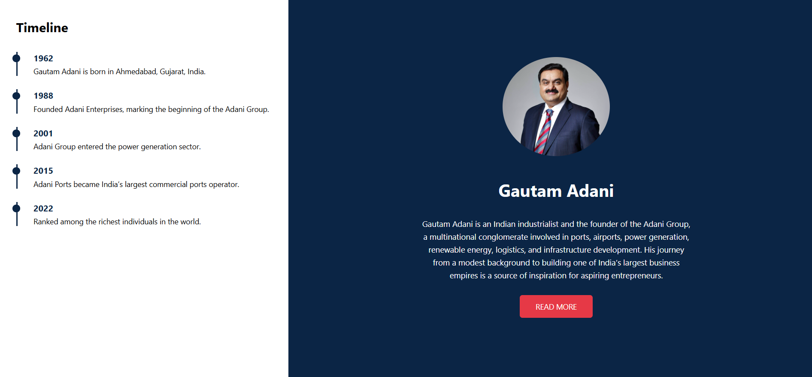

<!DOCTYPE html>
<html lang="en">
<head>
  <meta charset="UTF-8">
  <title>Tribute Page Project</title>
</head>
<body>

  <h1>Tribute Page Using HTML and CSS</h1>

  

    The Tribute Page is a simple web project created using <strong>HTML</strong> and
    <strong>CSS</strong>. The main purpose of this project is to design a visually
    appealing webpage dedicated to a person who is admired, highlighting their
    life, achievements, and inspirational journey.
  

  <h1>Project Description</h1>

  

    This project demonstrates how basic web technologies can be used to create
    an attractive and informative tribute page. The webpage contains well-structured
    paragraphs, images, and a timeline layout to present important milestones
    in the life of the admired personality.
  

  

    Different font styles, background colors, and layout techniques are used to
    enhance readability and improve the overall user experience. The project
    focuses on clean design, proper alignment, and content organization.
  

  <h1>Features</h1>

  <ul>
    <li>Clean and attractive user interface</li>
    <li>Profile image of the admired personality</li>
    <li>Timeline section highlighting key life events</li>
    <li>Proper use of headings and paragraphs</li>
    <li>Custom fonts, colors, and layout styling</li>
  </ul>

  <h1>Technologies Used</h1>

  <ul>
    <li><strong>HTML5</strong> – Structure and content of the webpage</li>
    <li><strong>CSS3</strong> – Styling, layout, and visual design</li>
  </ul>

  <h1>Tribute Page Preview</h1>

  

  

   

</body>
</html>
